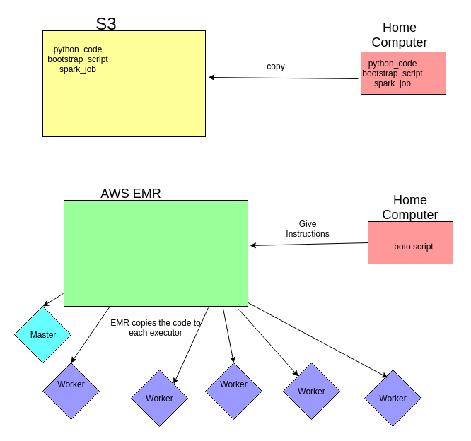

..  _lesson10_2:

=========================================
Architecture of EMR
=========================================

Questions
=========

1. If you have a very powerful computer, will your job run faster?
2. Look at the diagram. Where is the "brain" that controls all the communication and workers?

<< :ref:`lesson10` | :ref:`lesson10_3`  >>

