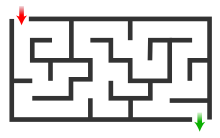

..  _lesson1_2:

========================
Slow Data = No Data
========================

- Solve the following problem

- What happens if each trial takes 2 hours to complete?
- It won't just take you longer--you will give up!

<< :ref:`introduction` | :ref:`lesson2`  >>
