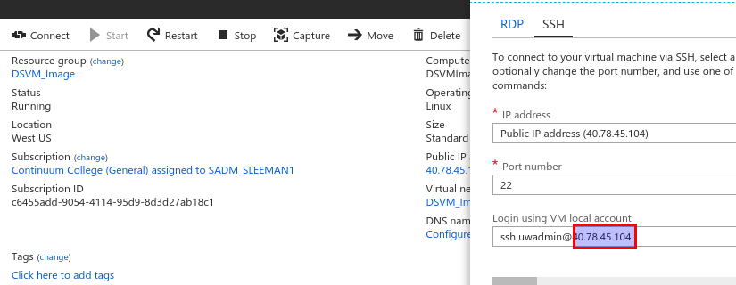

..  _lesson2_13:

===========
Run X2GO
===========

1. Go to: https://portal.azure.com/#blade/HubsExtension/Resources/resourceType/Microsoft.Resources%2Fresources
   Claim an image

2. Get the IP address:

<< :ref:`lesson2_12` | :ref:`lesson2_14`  >>
