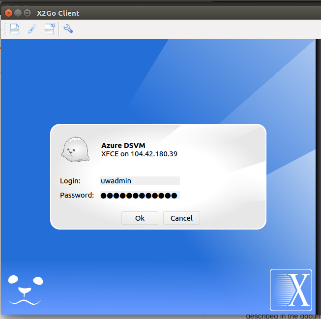
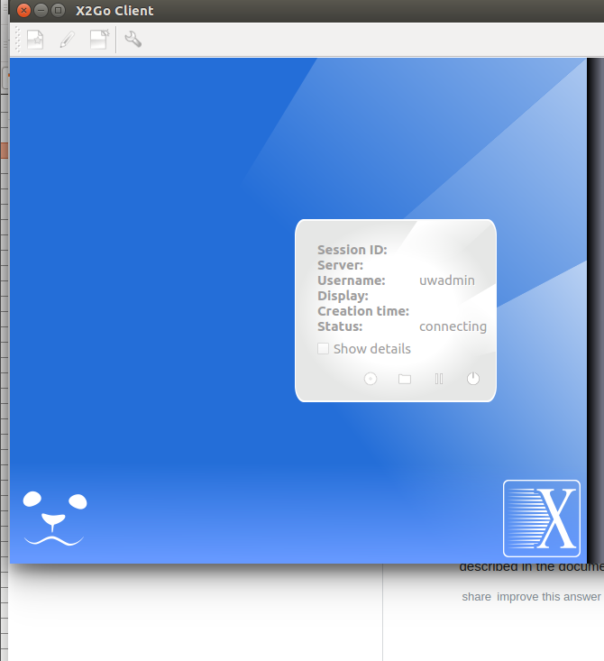

..  _lesson2_16:

===========
Run X2GO
===========

3. Launch x2go and fill in the right fields

And..

.. wget https://www.python.org/ftp/python/3.6.5/Python-3.6.5.tgz
.. tar -xvzf Python-3.6.5.tgz
.. cd Python-3.6.5/
.. ./configure --prefix=$HOME/python
.. make && make install
.. ~/python/bin/pip3 install virtualenvwrapper
.. source ~/python/bin/virtualenvwrapper.sh
.. mkvirtualenv -p ~/python/bin/python3  class

wget https://s3-us-west-2.amazonaws.com/paulhtremblaypublic/python_code/python_big_data_tools-.2.tar.gz
tar -xvzf python_big_data_tools-.2.tar.gz
cd python_big_data_tools-.2/
python setup.py install
conda create -n class
source activate class
conda install pyshp conda install Shapely

<< :ref:`lesson2_15` | :ref:`lesson2_17`  >>

