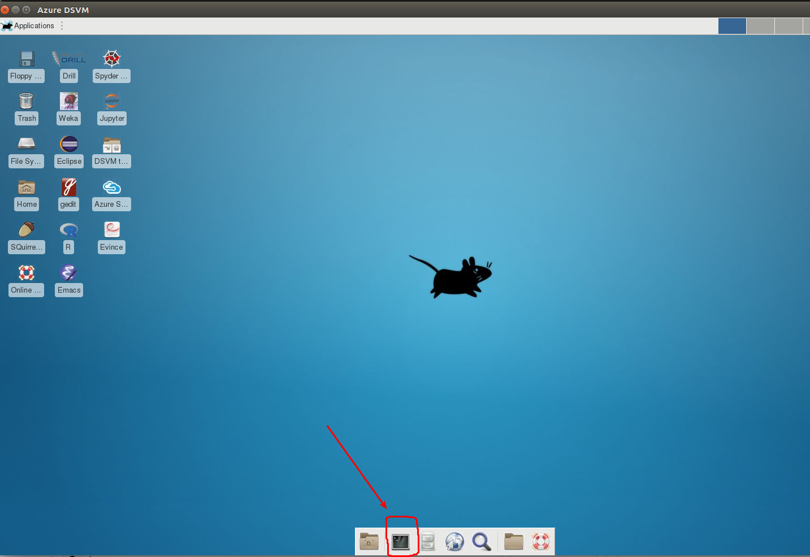
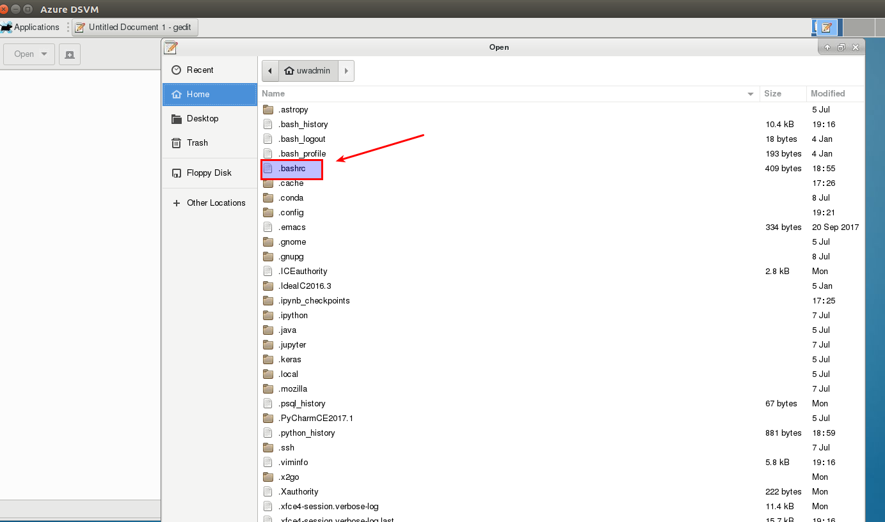

..  _lesson2_17:

==============================
Configure Image
==============================

Install Needed Software
========================

Open a terminal

Create an environment::

 conda create -n class
 source activate class

Install basic libraries::

 conda install bokeh pyshp Shapely jupyter

Install my graphing library. Instead of 'x', use the latest version::

 wget https://s3-us-west-2.amazonaws.com/paulhtremblaypublic/python_code/python_big_data_tools-.2x.tar.gz
 tar -xvzf python_big_data_tools-.2.tar.gz
 cd python_big_data_tools-.2x/
 python setup.py install

Setup the environmental variables

First open up gedit editor. (You can use another editor if you like). Choose the open option.
*Press Ctrl h*. You will now see the hidden files. 

Open up .bashrc, and put the following::

 export PYTHONPATH=$SPARK_HOME/python/:$PYTHONPATH
 export PYSPARK_PYTHON=~/.conda/envs/class/bin/python

Get the python code for this course::

 cd ~/
 wget://s3-us-west-2.amazonaws.com/paulhtremblaypublic/python_code/python_code.tar.gz 

Make a workspace directory::

 cd ~/
 mkdir workspace

<< :ref:`lesson2_16` | :ref:`lesson3`  >>

