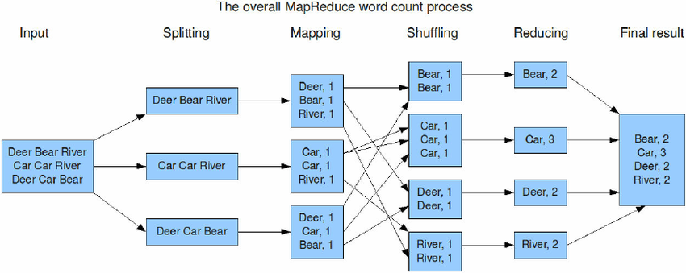

..  _lesson3_3:

=================================
Day 3 (3): Map/Reduce Word Count
=================================

architecture:

In addition, the code must be copied to *each* node.

.. image:: img/map_reduce_copied.png

Questions
=========

1. How do you think the code gets copied? 
2. How does map/reduce decide on what to shuffle? 

<< :ref:`lesson3_2` | :ref:`lesson3_4`  >>

