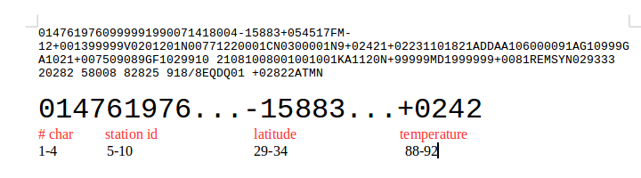

..  _lesson4_2:

=============
Lesson 4 (2)
=============

Introduction to the NOAA fixed character format
=================================================

- The records always occurr in the same position. Or example, the temperatuer occurs from character 88 to character 92
- Some of the records have to divided. For example, the temperature is in Celcius, multiplied by 10. The real values is
  242/10 = 24.2 C
- Missing data is represented by special numbers. For example, "9999" means there is no data. We have to ignore
  these records
- The full set is here: https://s3.console.aws.amazon.com/s3/buckets/paulhtremblay/noaa/data/?region=us-east-1&tab=overview
- Samples are here: https://s3.console.aws.amazon.com/s3/buckets/paulhtremblaypublic/noaa_data/?region=us-east-1&tab=overview

Using Parsers
=============

For this class, we will use a parser I wrote to process each line. Using a parser will make our work easier and 
allow us to focus on the important parts. Below is the code. You don't need to understand this code or study it.
Just understand the parser converts the fixed-format into a Python dictionary.

Example Use:

.. literalinclude:: ../python_code/parsers/noaa_example.py
   :language: python
   :linenos:

The result::

 {   'air_temperature_observation_air_temperature': 24.2,
    'air_temperature_observation_air_temperature_quality_code': '1',
    'air_temperature_observation_dew_point_quality_code': '1',
    'air_temperature_observation_dew_point_temperature': 22.3,
    'atmospheric_pressure_observation_sea_level_pressure': 1018.2,
    'atmospheric_pressure_observation_sea_level_pressure_quality_code': '1',
    'fixed_weather_station_call_letter_identifier': '99999',
    'fixed_weather_station_ncei_wban_identifier': 99999,
    'fixed_weather_station_usaf_master_station_catalog_identifier': '619760',
    'geophysical_point_observation_additional_data_identifier': 'ADD',
    'geophysical_point_observation_data_source_flag': '4',
    'geophysical_point_observation_elevation_dimension': 13,
    'geophysical_point_observation_latitude_coordinate': -15.883,
    'geophysical_point_observation_longitude_coordinate': 54.517,
    'geophysical_report_type_code': 'FM-12',
    'liquid_precipitation_occurrence_identifier': 'AA1',
    'meteorological_point_observation_quality_control_process_name': 'V020',
    'point_observation_date_time': datetime.datetime(1990, 7, 14, 18, 0),
    'sky_condition_observation_cavok_code': 'N',
    'sky_condition_observation_ceiling_determination_code': 'C',
    'sky_condition_observation_ceiling_height_dimension': 22000,
    'sky_condtion_observation_ceiling_quality_code': 1,
    'total_variable_characters': 147,
    'visibility_observation_distance_dimension': 30000,
    'visibility_observation_distance_quality_code': 1,
    'visibility_observation_quality_variability_code': 9,
    'visibility_observation_variability_code': 'N',
    'wind_observation_direction_angle': 120,
    'wind_observation_direction_quality_code': 1,
    'wind_observation_speed_quality_code': 1,
    'wind_observation_speed_rate': 77,
    'wind_observation_type_code': 'N'}

<< :ref:`lesson4` | :ref:`lesson4_3`  >>
