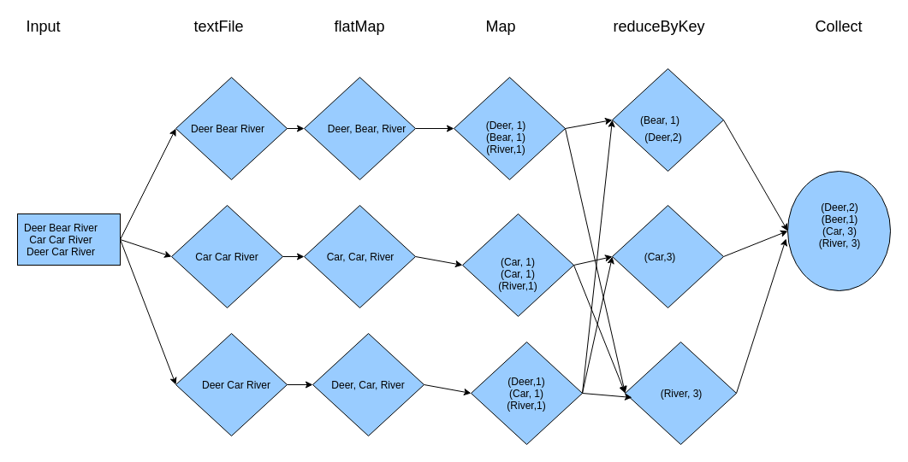

..  _lesson6_4:

=======================================
Architecture behind simple word count
=======================================

Questions:
==========

1. How many times was the data read/written to disk?
2. How does this example differ from map/reduce?
3. What is the slowest part of the pipeline, and why? 

Class Exercise
===============

Write a spark job to count the number of words in David Copperfied (found here: http://www.gutenberg.org/files/43111/)

<< :ref:`lesson6_3` | :ref:`lesson6_5`  >>

