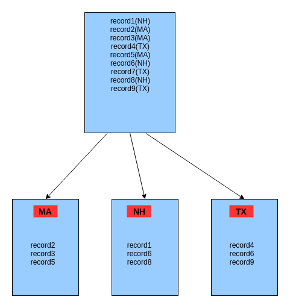

..  _lesson7_10:

=====================================================
Partitioning with  groupByKey
=====================================================

- Problem: We want to look at consecutive records, but in a big data way, by partitioning 
  certain data on certain nodes.

<< :ref:`lesson7_9` | :ref:`lesson7_11`  >>
