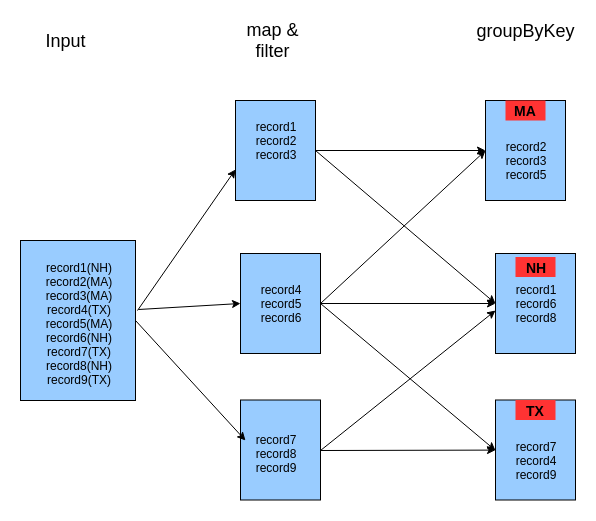

..  _lesson7_11:

=====================================================
groupByKey: Architecture Overview
=====================================================

- Solution: groupByKey

- groupByKey is a *wide* transformation. It shuffles data across partitions

<< :ref:`lesson7_10` | :ref:`lesson7_12`  >>
