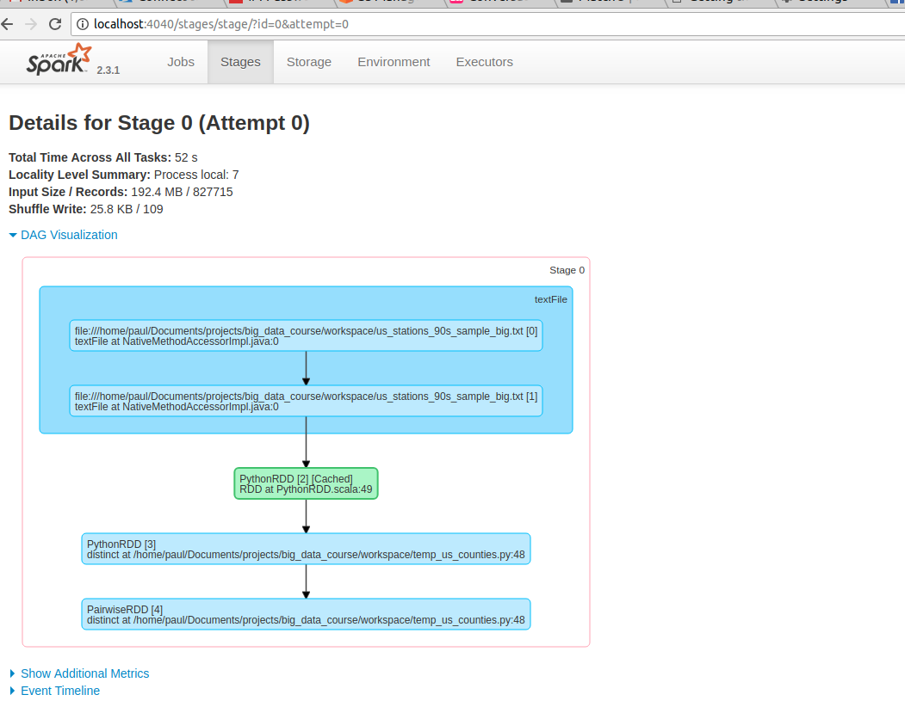
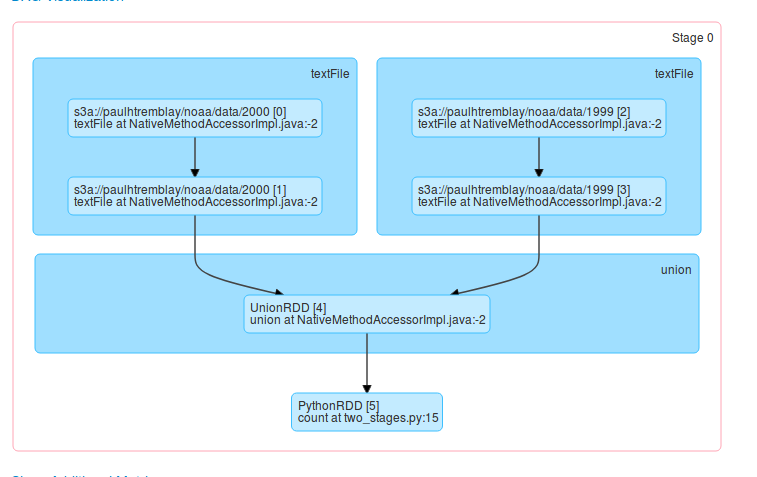

..  _lesson7_8:

=====================================================
Spark RDD in detail
=====================================================

1. Launch the following job:

`spark-submit --conf spark.ui.showConsoleProgress=true --py-files dependencies.zip temp_us_counties.py`

2. Go to: http://localhost:4040/jobs/

3. Click on 'stages' and then click on the first active stage 

- RDD stands for Resilient Distributed Datasets

- An RDD is immutable

- It is divided into tasks and distributed across partitions

- Our job had 3 partitions

- Our job had many task

- We can think of each job as a Directed Acrylic Graph, or DAG 

Look at :ref:`lesson6_7`. The DAG for that job would look like this:

You can also see the DAG in the console::

 [Stage 2:===================>                                       (10 + 2) / 20]

This means we are in stage 2. We have run 10 tasks. There are a total 20 tasks. 2 
tasks are active.

Questions
=========

1. Why is only one active task running in our jobs?
2. How can we increase the number of active tasks?
3. What happens to our execution time as we increase the number of active tasks?

<< :ref:`lesson7_7` | :ref:`lesson7_9`  >>
